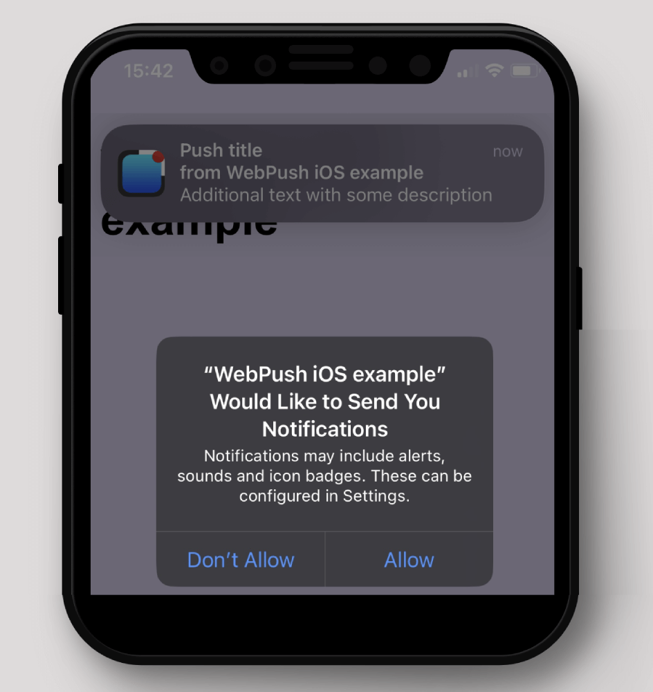
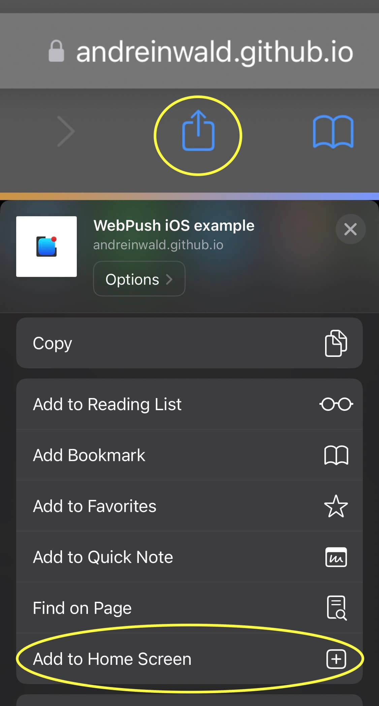

# WebPush for iOS sample code and demo site
_WebPush - is browser technology that allows site developer send notifications from backend to subscribers. Now at iPhone and iPad!_
<br><br>
<b>Demo https://andreinwald.github.io/webpush-ios-example </b><br>



<br><br>
**TL;DR iOS WebPush specifics**
- user required to add your site to **Home Screen** of his iPhone/iPad
- manifest.json is required to set **display: standalone**
- you **don't need** to register at apple.com to receive something like **GCM_SENDER_ID**
- instead, you need to generate **VAPID** (pair of public and private keys)
<br/>

https://github.com/andreinwald/webpush-ios-example/assets/7912182/fa89c846-4b97-4fe2-93ca-0c4f4e2e9647

---
# More info
- [Basic WebPush subscription code](#Basic-WebPush-subscription-code)
- [Generating VAPID key](#Generating-VAPID-key)
- [Installing PWA on iOS by adding to Home Screen](#Installing-PWA-on-iOS-by-adding-to-Home-Screen)
- [Subscription and saving token (Prompt with permission)](#Subscription-and-saving-token)
- [Service worker](#Service-worker)
- [Sending push message](#Sending-push-message)

## Basic WebPush subscription code
Example of basic subscription code, that works in Google Chrome and Firefox.<br>
```html
<html>
<body>
<button onclick="subscribe()">Subscribe</button>

<script>
    // You can use serviceworker.js from this repo
    // It should contain listeners for push and notificationclick events
    navigator.serviceWorker.register('/serviceworker.js');

    function subscribe() {
        navigator.serviceWorker.ready.then(async function (serviceWorker) {
            if (!serviceWorker.pushManager) {
                // Maybe iOS on iPhone or iPad - should ask for adding to Home Screen
                alert('pushManager is not enabled');
                return;
            }            
            let subscriptionOptions = {
                userVisibleOnly: true,
                applicationServerKey: '____INSERT_VAPID_PUBLIC_KEY_HERE_____'
            };
            let subscription = await serviceWorker.pushManager.subscribe(subscriptionOptions);
            console.log('Subscription token:', subscription.toJSON());
        });
    }
</script>
</body>
</html>
```
You can run it locally by creating index.html and serviceworker.js files with a simple html server:
```shell
npx http-server
```

## Generating VAPID key
In example above you need to replace VAPID_PUBLIC_KEY to your own.<br><br>

You **don't need** to register at apple.com to receive something like **GCM_SENDER_ID**, just generate VAPID key
- All subscription tokens associated with that key, so if you change it - you may lose old subscribers
- You MUST need generate your own VAPID keys!
- Newer share your PRIVATE_VAPID_KEY. It should be stored in a safe storage
<br>
Run this command in your terminal for generating:

```shell
npx web-push generate-vapid-keys

# result will be like:
# Public Key: BAwUJxIa7mJZMqu78Tfy2vqbp1tFuj4KwX3gRuF2e_5WGB0tGnvCBGtvVDEa6YdjnjAors3E1WBlcCTow6pGg
# Private Key: Mmi54fYPtCgTQB1_8-QoH0xJOq3H6z8nBUG71t0ezCA
```

Then use it in frontend.js:
```javascript
const VAPID_PUBLIC_KEY = 'BAwUJxIa7mJZMqu78Tfy2...';
let subscriptionOptions = {
    userVisibleOnly: true,
    applicationServerKey: VAPID_PUBLIC_KEY
};
```
<br>

See full example in [frontend.js](/frontend.js)


## Installing PWA on iOS by adding to Home Screen
WebPush is Progressive Web App(PWA) feature so you need to ask user to enable PWA mode first.<br>
On iOs devices it can be made with button **"Add to Home Screen"** in browser.<br><br>


Also don't forget to set display mode in **manifest.json**!<br>
Manifest.json required to set "display: standalone", that called by Apple "Home Screen web app"<br>
PushManager will appear in serviceWorker object **only after** adding site to Home screen at your iPhone.

```html
<html>
<head>
    <link rel="manifest" href="manifest.json"/>
</head>
# ...
```
manifest.json:
```json
{
  "name": "WebPush iOS example",
  "display": "standalone"
}
```
**Next you can check that PWA is installed by this code:**
```javascript
if (window.navigator.standalone) {
    // now we can ask for subscription by pushManager.subscribe()
} else {
    // we should ask user to add our site home screen
}
```


## Subscription and saving token
(Displaying Prompt with permission)<br>
After registering Service Worker and providing VAPID_PUBLIC_KEY you can request user to subscribe.<br>
Best practice will be to ask user about subscription in html popup first.<br>
Then you can call:
```javascript
let subscription = await pushManager.subscribe(subscriptionOptions);
```
See full example in [frontend.js](/frontend.js)
<br><br>

After receiving subscription you're going to send it to backend via fetch or something.<br>
You will need that for [sending push message from backend](#Sending-push-message)
<br>
**Examples how subscription token looks:**<br><br>
For desktop and mobile Safari:
```json
{
  "endpoint": "https://web.push.apple.com/QGuQyavXutnMH...",
  "keys": {
    "p256dh": "BF6-hyiRMKKKiiH...",
    "auth": "lM6vKjBJ1UX..."
  }
}
```
And this will be for Google Chrome (FCM):
```json
{
  "endpoint": "https://fcm.googleapis.com/fcm/send/eEsw5ryoAzo:APA91bHC...",
  "expirationTime": null,
  "keys": {
    "p256dh": "BKDBx7wkagZSlDsaT...",
    "auth": "zKa3taDY2VWoM4..."
  }
}
```

## Service worker
For receiving, displaying push message and processing click on it - you need to use these service worker methods:
```javascript
self.addEventListener('push', (event) => {
    let pushData = event.data.json();
    // ...
    self.registration.showNotification(pushData.title, pushData)
});

self.addEventListener('notificationclick', function (event) {
    clients.openWindow(event.notification.data.url)
    // ...
    // You can send fetch request to your analytics API fact that push was clicked
});
```
See full example in [serviceworker.js](/serviceworker.js)

## Sending push message
You can send WebPush from **frontend**:
```javascript
const title = "Push title";
const options = {
    body: "Additional text with some description",
    icon: "https://andreinwald.github.io/webpush-ios-example/images/favicon.png",
    image: "https://upload.wikimedia.org/wikipedia/commons/thumb/6/68/Orange_tabby_cat_sitting_on_fallen_leaves-Hisashi-01A.jpg/1920px-Orange_tabby_cat_sitting_on_fallen_leaves-Hisashi-01A.jpg",
    data: {
        "url": "https://andreinwald.github.io/webpush-ios-example/?page=success",
        "message_id": "your_internal_unique_message_id_for_tracking"
    },
};
navigator.serviceWorker.ready.then(function (serviceWorker) {
    serviceWorker.showNotification(title, options);
});
```

Or from **Backend**, for example by using **Node.js** [web-push library](https://github.com/web-push-libs/web-push) <br> 
See example in [backend-sender.js](/backend-sender.js)

## Resources:
- [Meet Web Push for Safari on developer.apple.com](https://developer.apple.com/videos/play/wwdc2022/10098/)
- [Sending web push notifications in web apps and browsers on developer.apple.com](https://developer.apple.com/documentation/usernotifications/sending_web_push_notifications_in_web_apps_and_browsers)
- [Vapid token standard](https://blog.mozilla.org/services/2016/08/23/sending-vapid-identified-webpush-notifications-via-mozillas-push-service/)
- [VAPID RFC standard](https://datatracker.ietf.org/doc/html/rfc8292)
- [Webpush options like image and actions](https://developer.mozilla.org/en-US/docs/Web/API/ServiceWorkerRegistration/showNotification)
- [Web App Manifest for standalone mode](https://developer.mozilla.org/en-US/docs/Web/Manifest)
- [The ServiceWorker lifecycle](https://web.dev/articles/service-worker-lifecycle)

## Keywords:
- ServiceWorkerRegistration.pushManager is undefined
- applicationServerKey is not properly base64url-encoded
- undefined is not an object pushManager.subscribe
- User denied push permission
