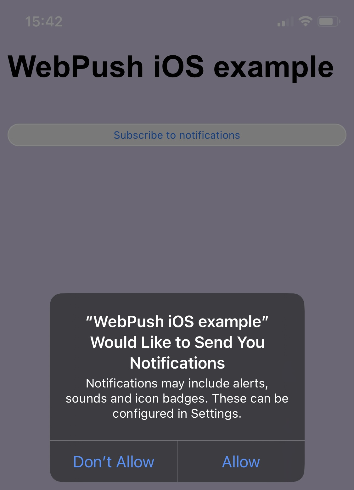

# WebPush for iOS sample code and demo site



## Generating VAPID key
- All subscription tokens associated with that key, so if you change it - you may lose old subscribers
- You MUST need generate your own VAPID keys!
- Newer share your PRIVATE_VAPID_KEY. It should be stored in a safe storage

```shell
openssl ecparam -genkey -name prime256v1 -out vapid_private.pem
openssl ec -in vapid_private.pem -pubout -outform DER|tail -c 65|base64|tr -d '=' |tr '/+' '_-' >> vapid_public.txt
echo 'VAPID public:' ; cat vapid_public.txt
# Example: BCa4t85iJ0AYDG__5r48lo-HNdpi_29458t8R6zRTsF1OUi1QyvCRd_tOyXVkqH3nzsZdMzSRLlKJTXQyN7QI4s
openssl ec -in vapid_private.pem -outform DER|tail -c +8|head -c 32|base64|tr -d '=' |tr '/+' '_-' >> vapid_private.txt
echo 'VAPID private:' ; cat vapid_private.txt
# Example: Mz8GQ4Fx16dI-iEUZTp6KTLVsUrcIOfJmWWXlKb0Qgo
```

## Result of subscription
For desktop and mobile Safari:
```json
{
  "endpoint": "https://web.push.apple.com/QGuQyavXutnMH...",
  "keys": {
    "p256dh": "BF6-hyiRMKKKiiH...",
    "auth": "lM6vKjBJ1UX..."
  }
}
```
And this will be for Google Chrome (FCM):
```json
{
  "endpoint": "https://fcm.googleapis.com/fcm/send/eEsw5ryoAzo:APA91bHC...",
  "expirationTime": null,
  "keys": {
    "p256dh": "BKDBx7wkagZSlDsaT...",
    "auth": "zKa3taDY2VWoM4..."
  }
}
```


Resources:
- [Meet Web Push for Safari on developer.apple.com](https://developer.apple.com/videos/play/wwdc2022/10098/)
- [Sending web push notifications in web apps and browsers on developer.apple.com](https://developer.apple.com/documentation/usernotifications/sending_web_push_notifications_in_web_apps_and_browsers)
- [Vapid token standard](https://blog.mozilla.org/services/2016/08/23/sending-vapid-identified-webpush-notifications-via-mozillas-push-service/)
- [VAPID RFC standard](https://datatracker.ietf.org/doc/html/rfc8292)
- [Webpush options like image and actions](https://developer.mozilla.org/en-US/docs/Web/API/ServiceWorkerRegistration/showNotification)
- [Web App Manifest for standalone mode](https://developer.mozilla.org/en-US/docs/Web/Manifest)
- [The ServiceWorker lifecycle](https://web.dev/articles/service-worker-lifecycle)

Keywords:
- ServiceWorkerRegistration.pushManager is undefined
- undefined is not an object pushManager.subscribe
- User denied push permission
